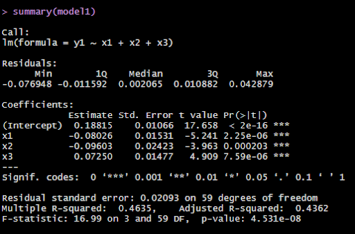
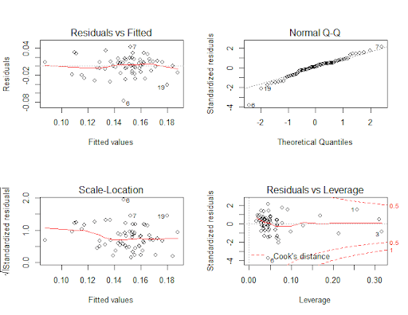
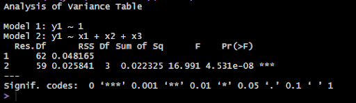
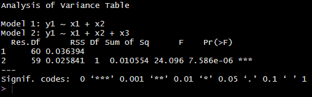

# Multi-Linear-Regression-Stock-Performance

Applying Multi-Linear Regession Models (ANOVA and Stepwise) using R/R-Studio and a dataset provided by UC Irvine Machine Learning Repository. Data repository can be find in the link below. 

Data set: https://archive.ics.uci.edu/ml/datasets/Stock+portfolio+performance

Overview:  Dataset: Stock portfolio performance (all periods);  Variables: Response (y1)= Annual Return; Predictors(x1,x2,x3) = Large Market Value, Total Risk, Large S/P; respectively 

 
 (Figure 1.1)
 
i. State the fitted regression equation:  y1= .18815 + (-0.08026)x1+ (-0.09603)x2+ (0.07250)x3

ii. Interpret the regression coefficients: 
	 0.18815 is the y-intercept: Estimated mean Total Risk at y =0
	-0.08026 is the effect Large Market Value has on Total Risk
	-0.09603 is the effect Large ROE has on Total Risk
	 0.07250 is the effect Large Return Rate in the last quarter has on the Total Risk
 

(Figure 1.2)

Above is a table showing the Model Assumptions of Multiple Linear Regression. The red line in the Residuals vs fitted plot is fairly straight suggesting that the linearity assumption. For the Normal Q-Q plot we can see that the data is fairly normal, Scale-Location shows a decreasing variance.

iii. ) Produce an ANOVA table. Report , SST,SSR, and SSE, and their corresponding degrees of freedom : 
ANOVA Table:

(Figure 1.3)

SSE = 0.02235; SSR = 0.025841; SST= (SSE+SSR)= 0.048191; DF: 3 & 59: Given from the Analysis of Variance Table

iv. ) Perform an F test of overall linear relationship. State the hypotheses, the value of F test statistic, p-value, and your conclusion:  Null Hypothesis: B¹=B²=B³= 0; Alternative Hypothesis: One or more slope terms is non-zero

P-value: 4.531e-08; F test statistic: 2.760767

Conclusion: Given that the p-value is extremely small we conclude that we can reject the null Hypothesis and that one more slope terms is non zero
v. ) Test whether x3 is helpful, given that x1 and x2 are in the model. State the hypotheses, the value of  t-test statistic, p-value, and your conclusion. 

(Figure 1.4)

Null Hypothesis: No significant difference in SSE of the original and reduced model 
Alter Hypothesis: Full model has a significantly lower SSE than the reduced model 

Considering that the p-value is extremely small (7.586e-06), we conclude that we will reject the null Hypothesis and that our full model is significantly better and has a lower SSE.

Data set: https://archive.ics.uci.edu/ml/datasets/Stock+portfolio+performance
